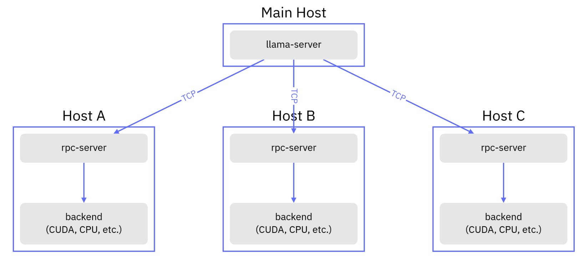
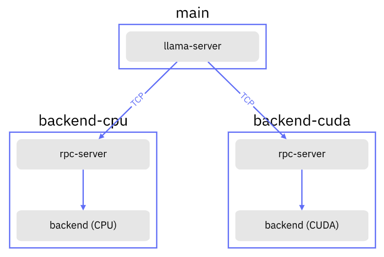

# llama.cpp RPC-server in Docker

This project is based on [llama.cpp](https://github.com/ggerganov/llama.cpp) and compiles only
the [RPC](https://github.com/ggerganov/llama.cpp/tree/master/examples/rpc) server, along with auxiliary utilities
operating in RPC client mode, which are necessary for implementing distributed inference of Large Language Models (LLMs)
and Embedding Models converted into the GGUF format.

[Русский](./README.md) | [中文](./README.zh.md) | **English**

## Overview

The general architecture of an application using the RPC server looks as follows:



Instead of `llama-server`, you can use `llama-cli` or `llama-embedding`, which are included in the standard container
package.

Docker images are built with support for the following architectures:

* **CPU-only** - amd64, arm64, arm/v7
* **CUDA** - amd64

Unfortunately, CUDA builds for arm64 fail due to an error, so they are temporarily disabled.

## Environment Variables

| Name               | Default                                    | Description                                                                                      |
|--------------------|--------------------------------------------|--------------------------------------------------------------------------------------------------|
| APP_MODE           | backend                                    | Container operation mode, available options: server, backend, and none                           |
| APP_BIND           | 0.0.0.0                                    | Interface to bind to                                                                             |
| APP_PORT           | `8080` for `server`, `50052` for `backend` | Port number on which the server is running                                                       |
| APP_MEM            | 1024                                       | Amount of MiB of RAM available to the client; in CUDA mode, this is the amount of GPU memory     | 
| APP_RPC_BACKENDS   | backend-cuda:50052,backend-cpu:50052       | Comma-separated addresses of backends that the container will try to connect to in `server` mode |
| APP_MODEL          | /app/models/TinyLlama-1.1B-q4_0.gguf       | Path to the model weights inside the container                                                   | 
| APP_REPEAT_PENALTY | 1.0                                        | Repeat penalty                                                                                   |
| APP_GPU_LAYERS     | 99                                         | Number of layers offloaded to the backend                                                        |

## Example of docker-compose.yml

In this example, `llama-server` (container `main`) is launched and the
model [TinyLlama-1.1B-q4_0.gguf](https://huggingface.co/TheBloke/TinyLlama-1.1B-Chat-v1.0-GGUF/tree/main), which was
previously downloaded to the `./models` directory located at the same level as `docker-compose.yml`, is initialized. The
`./models` directory is then mounted inside the `main` container and is available at the path `/app/models`.

```yaml
version: "3.9"

services:

  main:
    image: evilfreelancer/llama.cpp-rpc:latest
    restart: unless-stopped
    volumes:
      - ./models:/app/models
    environment:
      # Operation mode (RPC client in API server format)
      APP_MODE: server
      # Path to the model weights, preloaded inside the container
      APP_MODEL: /app/models/TinyLlama-1.1B-q4_0.gguf
      # Addresses of the RPC servers the client will interact with
      APP_RPC_BACKENDS: backend-cuda:50052,backend-cpu:50052
    ports:
      - "127.0.0.1:8080:8080"

  backend-cpu:
    image: evilfreelancer/llama.cpp-rpc:latest
    restart: unless-stopped
    environment:
      # Operation mode (RPC server)
      APP_MODE: backend
      # Amount of system RAM available to the RPC server (in Megabytes)
      APP_MEM: 2048

  backend-cuda:
    image: evilfreelancer/llama.cpp-rpc:latest-cuda
    restart: "unless-stopped"
    environment:
      # Operation mode (RPC server)
      APP_MODE: backend
      # Amount of GPU memory available to the RPC server (in Megabytes)
      APP_MEM: 1024
    deploy:
      resources:
        reservations:
          devices:
            - driver: nvidia
              count: 1
              capabilities: [ gpu ]
```

A complete example is available in [docker-compose.dist.yml](./docker-compose.dist.yml).

As a result, we obtain the following diagram:



Once launched, you can make HTTP requests like this:

```shell
curl \
    --request POST \
    --url http://localhost:8080/completion \
    --header "Content-Type: application/json" \
    --data '{"prompt": "Building a website can be done in 10 simple steps:"}'
```

## Manual Docker Build

Building containers in CPU-only mode:

```shell
docker build ./llama.cpp/
```

Building the container for CUDA:

```shell
docker build ./llama.cpp/ --file ./llama.cpp/Dockerfile.cuda
```

Using the build argument `LLAMACPP_VERSION`, you can specify the tag version, branch name, or commit hash to build the
container from. By default, the `master` branch is specified in the container.

```shell
# Build the container from the tag https://github.com/ggerganov/llama.cpp/releases/tag/b3700
docker build ./llama.cpp/ --build-arg LLAMACPP_VERSION=b3700
```

```shell
# Build the container from the master branch
docker build ./llama.cpp/ --build-arg LLAMACPP_VERSION=master
# or simply
docker build ./llama.cpp/
```

## Manual Build Using Docker Compose

An example of docker-compose.yml that performs image building with an explicit tag specification:

```yaml
version: "3.9"

services:

  main:
    restart: "unless-stopped"
    build:
      context: ./llama.cpp
      args:
        - LLAMACPP_VERSION=b3700
    volumes:
      - ./models:/app/models
    environment:
      APP_MODE: none
    ports:
      - "8080:8080"

  backend:
    restart: "unless-stopped"
    build:
      context: ./llama.cpp
      args:
        - LLAMACPP_VERSION=b3700
    environment:
      APP_MODE: backend
    ports:
      - "50052:50052"
```

## Links

- https://github.com/ggerganov/ggml/pull/761
- https://github.com/ggerganov/llama.cpp/issues/7293
- https://github.com/ggerganov/llama.cpp/pull/6829
- https://github.com/ggerganov/llama.cpp/tree/master/examples/rpc
- https://github.com/mudler/LocalAI/commit/fdb45153fed10d8a2c775633e952fdf02de60461
- https://github.com/mudler/LocalAI/pull/2324
- https://github.com/ollama/ollama/issues/4643

## Citing

```text
[Pavel Rykov]. (2024). llama.cpp RPC-server in Docker. GitHub. https://github.com/EvilFreelancer/docker-llama.cpp-rpc
```

```text
@misc{pavelrykov2024llamacpprpc,
  author = {Pavel Rykov},
  title  = {llama.cpp RPC-server in Docker},
  year   = {2024},
  url    = {https://github.com/EvilFreelancer/docker-llama.cpp-rpc}
}
```
