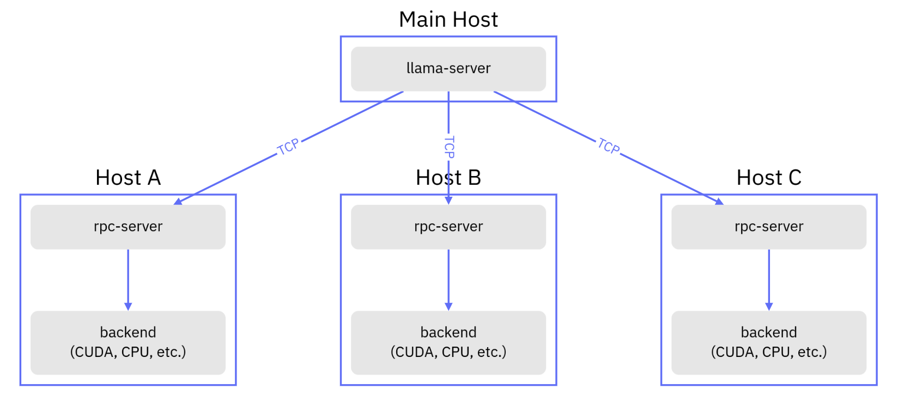
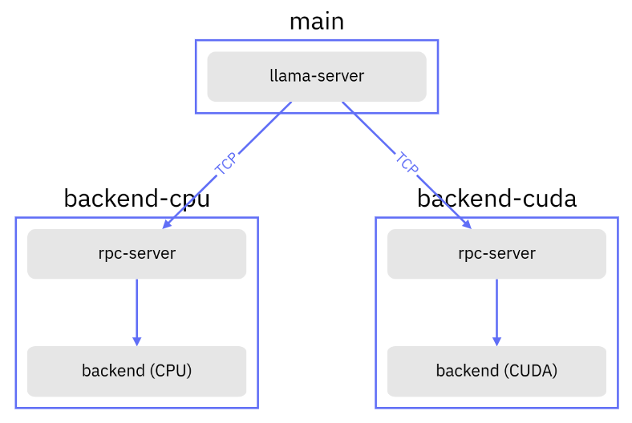

# llama.cpp RPC-server in Docker

Данный проект основан на [llama.cpp](https://github.com/ggerganov/llama.cpp) и компилирует
только [RPC](https://github.com/ggerganov/llama.cpp/tree/master/examples/rpc)-сервер, а так же
вспомогательные утилиты, работающие в режиме RPC-клиента, необходимые для реализации распределённого инференса
конвертированных в GGUF формат Больших Языковых Моделей (БЯМ) и Эмбеддинговых Моделей.

**Русский** | [中文](./README.zh.md) | [English](./README.en.md)

## Обзор

В общем виде схема приложения с использованием RPC-сервера имеет следующий вид:



Вместо `llama-server` можно использовать `llama-cli` или `llama-embedding`, они идут в стандартной поставке контейнера.

Docker-образы собираются с поддержкой следующих архитектур:

- **CPU-only** - amd64, arm64, arm/v7
- **CUDA** - amd64

К сожалению сборка CUDA под arm64 падает с ошибкой, поэтому она временно отключена.

## Переменные окружения

| Имя                | Дефолт                                         | Описание                                                                                                       |
|--------------------|------------------------------------------------|----------------------------------------------------------------------------------------------------------------|
| APP_MODE           | backend                                        | Режим работы контейнера, доступные варианты: `server`, `backend` и `none`                                      |
| APP_BIND           | 0.0.0.0                                        | Интерфейс на который происходит биндинг                                                                        |
| APP_PORT           | у `server` это `8080`, у `backend` это `50052` | Номер порта на котором запускается сервер                                                                      |
| APP_MEM            | 1024                                           | Количество Мб оперативной памяти доступной клиенту, в режиме CUDA это количество оперативной памяти видеокарты | 
| APP_RPC_BACKENDS   | backend-cuda:50052,backend-cpu:50052           | Разделённые запятой адреса бэкендов к которым будет пытаться подключиться контейнер в режиме `server`          |
| APP_MODEL          | /app/models/TinyLlama-1.1B-q4_0.gguf           | Путь к весам модели внутри контейнера                                                                          | 
| APP_REPEAT_PENALTY | 1.0                                            | Пенальти повторов                                                                                              |
| APP_GPU_LAYERS     | 99                                             | Количество слоёв выгружаемых на бэкенд                                                                         |

## Пример docker-compose.yml

В данном примере происходит запуск `llama-server` (контейнер `main`) и инициализация
модели [TinyLlama-1.1B-q4_0.gguf](https://huggingface.co/TheBloke/TinyLlama-1.1B-Chat-v1.0-GGUF/tree/main),
которая была заранее загружена в директорию `./models`, расположенную на одном уровне с `docker-compose.yml`. Директория
`./models` в свою очередь монтируется внутрь контейнера `main` и доступна по пути `/app/models`.

```yaml
version: "3.9"

services:

  main:
    image: evilfreelancer/llama.cpp-rpc:latest
    restart: unless-stopped
    volumes:
      - ./models:/app/models
    environment:
      # Режим работы (RPC-клиент в формате API-сервера)
      APP_MODE: server
      # Путь до весов, предварительно загруженной модели, внутри контейнера
      APP_MODEL: /app/models/TinyLlama-1.1B-q4_0.gguf
      # Адреса RPC-серверов с которыми будет взаимодействовать клиент
      APP_RPC_BACKENDS: backend-cuda:50052,backend-cpu:50052
    ports:
      - "127.0.0.1:8080:8080"

  backend-cpu:
    image: evilfreelancer/llama.cpp-rpc:latest
    restart: unless-stopped
    environment:
      # Режим работы (RPC-сервер)
      APP_MODE: backend
      # Количество доступной RPC-серверу системной оперативной памяти (в Мегабайтах)
      APP_MEM: 2048

  backend-cuda:
    image: evilfreelancer/llama.cpp-rpc:latest-cuda
    restart: "unless-stopped"
    environment:
      # Режим работы (RPC-сервер)
      APP_MODE: backend
      # Количество доступной RPC-серверу оперативной памяти видеокарты (в Мегабайтах)
      APP_MEM: 1024
    deploy:
      resources:
        reservations:
          devices:
            - driver: nvidia
              count: 1
              capabilities: [ gpu ]
```

Полный пример в [docker-compose.dist.yml](./docker-compose.dist.yml).

В результате чего у нас получается следующего вида схема:



После её запуска можно будет делать такого вида HTTP запросы:

```shell
curl \
    --request POST \
    --url http://localhost:8080/completion \
    --header "Content-Type: application/json" \
    --data '{"prompt": "Building a website can be done in 10 simple steps:"}'
```

## Ручная сборка через Docker

Сборка контейнеров в режиме CPU-only:

```shell
docker build ./llama.cpp/
```

Сборка контейнера под CUDA:

```shell
docker build ./llama.cpp/ --file ./llama.cpp/Dockerfile.cuda
```

При помощи аргумента сборки `LLAMACPP_VERSION` можно указать версию тега, название ветки или хеш коммита из которого
требуется выполнить сборку контейнера, по умолчанию в контейнере указана ветка `master`.

```shell
# Собрать контейнер из тега https://github.com/ggerganov/llama.cpp/releases/tag/b3700
docker build ./llama.cpp/ --build-arg LLAMACPP_VERSION=b3700
```

```shell
# Собрать контейнер из ветки master
docker build ./llama.cpp/ --build-arg LLAMACPP_VERSION=master
# или просто
docker build ./llama.cpp/
```

## Ручная сборка через Docker Compose

Пример `docker-compose.yml` который выполняет сборку образа с явным указанием тега.

```yaml
version: "3.9"

services:

  main:
    restart: "unless-stopped"
    build:
      context: ./llama.cpp
      args:
        - LLAMACPP_VERSION=b3700
    volumes:
      - ./models:/app/models
    environment:
      MODE: none
    ports:
      - "8080:8080"

  backend:
    restart: "unless-stopped"
    build:
      context: ./llama.cpp
      args:
        - LLAMACPP_VERSION=b3700
    environment:
      MODE: backend
    ports:
      - "50052:50052"
```

## Ссылки

- https://github.com/ggerganov/ggml/pull/761
- https://github.com/ggerganov/llama.cpp/issues/7293
- https://github.com/ggerganov/llama.cpp/pull/6829
- https://github.com/ggerganov/llama.cpp/tree/master/examples/rpc
- https://github.com/mudler/LocalAI/commit/fdb45153fed10d8a2c775633e952fdf02de60461
- https://github.com/mudler/LocalAI/pull/2324
- https://github.com/ollama/ollama/issues/4643
